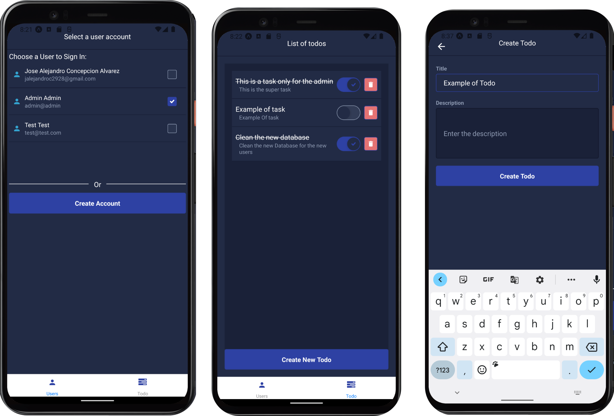

# TODO APP WITH SPRING, KOTLIN AND REACT NATIVE

## Backend
This is a backend application built with Spring, Kotlin, and Postgres for managing todos.

## Features

- CRUD operations for todos
- User authentication and authorization
- Database storage using Postgres

## Prerequisites

- Java Development Kit (JDK) 11 or higher
- Apache Maven
- Postgres database server

## UI

This is a React Native project that includes
various features and components to help you get
started with mobile app development.

## Features

- React Native UI Kitten integration
- Navigation using React Navigation
- User registration and authentication
- Todo management

## GALLERY

